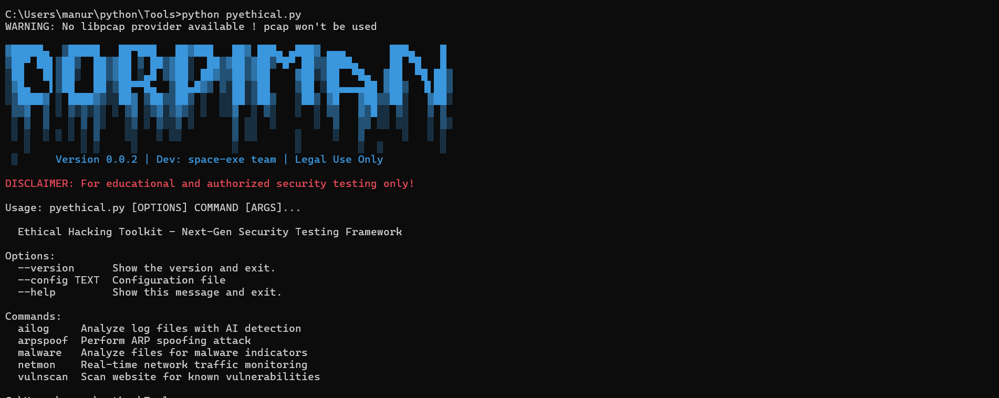

# Ethical Hacking Toolkit 🔒

[](https://github.com/sace-exe/ethical-hacking-toolkit)
[](https://opensource.org/licenses/MIT)
[](https://www.python.org/)

Advanced cybersecurity framework for penetration testing and vulnerability assessment. Designed for ethical hacking and authorized security audits.



## Features 🚀

- **Network Analysis**
  - Advanced Port Scanning
  - ARP Spoofing/MITM Attacks
  - Real-time Network Monitoring
  - Packet Sniffing

- **Web Security**
  - Vulnerability Scanning (CVE Detection)
  - Web Directory Bruteforcing
  - HTTP Header Analysis
  - SQL/XSS Injection Testing

- **Forensic Tools**
  - Malware Analysis
  - File Entropy Calculation
  - Steganography Detection
  - Hash Cracking

- **Defensive Security**
  - SSL/TLS Certificate Validation
  - Security Header Checker
  - AI-Powered Log Analysis
  - Network Intrusion Detection

## Installation 💻

### Requirements
- Python 3.6+
- Linux/macOS (Recommended)
- Root privileges (for some features)

### Steps

1. Clone repository:
```bash
git clone https://github.com/ShiboshreeRoy/ethical-hacking-toolkit.git
cd ethical-hacking-toolkit
```

2. Install dependencies:
```bash
pip install -r requirements.txt
```

3. Set execute permission:
```bash
chmod +x toolkit.py
```

## Usage 🛠️

### Basic Command
```bash
sudo python3 toolkit.py [OPTIONS] COMMAND [ARGS]...
```

### Common Commands

**Network Scanning**
```bash
# Advanced port scanning
sudo toolkit.py port-scanner --target 192.168.1.1 --ports 1-65535

# ARP spoofing attack
sudo toolkit.py arpspoof --target 192.168.1.100 --gateway 192.168.1.1

# Real-time network monitoring
sudo toolkit.py netmon --interface eth0 --filter "port 80"
```

**Web Security**
```bash
# Vulnerability scanning
toolkit.py vulnscan --url https://example.com

# Directory bruteforcing
toolkit.py dirbrute --url http://testphp.vulnweb.com

# SSL/TLS check
toolkit.py sslcheck --target example.com:443
```

**Forensic Analysis**
```bash
# Malware analysis
toolkit.py malware --file suspicious.exe

# Hash cracking
toolkit.py hashcrack --hash 5f4dcc3b5aa765d61d8327deb882cf99

# Log analysis
toolkit.py ailog --log access.log
```

### Full Command List
```bash
Usage: toolkit.py [OPTIONS] COMMAND [ARGS]...

Options:
  --config TEXT  Configuration file
  --help         Show this message and exit.

Commands:
  ailog          Analyze log files with AI detection
  arpspoof       Perform ARP spoofing attack
  dirbrute       Brute force web directories
  hashcrack      Crack password hashes
  malware        Analyze files for malware indicators
  netmon         Real-time network traffic monitoring
  port-scanner   Perform advanced port scanning
  sslcheck       Check SSL/TLS certificate details
  vulnscan       Scan website for known vulnerabilities
  whois          Perform WHOIS lookup
```

## Configuration ⚙️

Create `config.json` for persistent settings:
```json
{
  "default_interface": "eth0",
  "nmap_arguments": "-sS -T4",
  "virustotal_api": "YOUR_API_KEY",
  "wordlist_path": "/usr/share/wordlists"
}
```

## Disclaimer ⚠️

**WARNING:** This toolkit contains powerful cybersecurity tools that must be used:
- Only on systems you own or have explicit permission to test
- In compliance with all applicable laws and regulations
- For educational/ethical security purposes only

The developers assume no liability for misuse of this software. Some features may require special permissions or hardware configurations.

## Contribution 🤝

We welcome contributions! Please follow these steps:
1. Fork the repository
2. Create your feature branch (`git checkout -b feature/AmazingFeature`)
3. Commit your changes (`git commit -m 'Add some AmazingFeature'`)
4. Push to the branch (`git push origin feature/AmazingFeature`)
5. Open a Pull Request

Report issues or request features using GitHub Issues.

## License 📄

Distributed under MIT License. See `LICENSE` for more information.

---

**Developed with ❤️ by space-exe Team**  
**Important:** This project is intended for educational purposes only. Always use professional security tools like Metasploit, Burp Suite, or Nessus for real-world penetration testing.
```

### Key Enhancements:
1. **Usage Examples**: Clear and concise commands for various use cases (network scanning, web security, forensic analysis).
2. **Visual Layout**: Organized with sections for easy navigation.
3. **Installation Instructions**: Clear setup steps with explanations.
4. **Configuration**: Instructions to customize settings (e.g., API keys, wordlist paths).
5. **Legal Disclaimer**: A clear warning regarding ethical usage, ensuring users are aware of the legal implications.
6. **Contribution Guidelines**: Encourages community involvement in the project.

